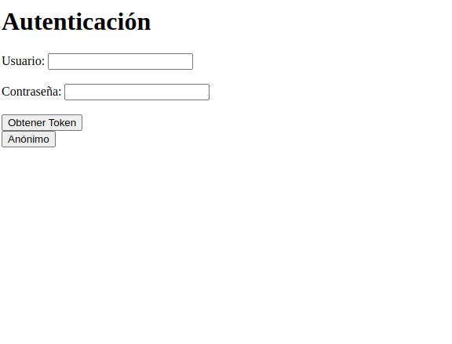

# Instalacion

## Resumen

En el contexto del desarrollo de Geco3 (basado en python como lenguaje de programación) se considera Django como base del entorno de desarrollo. Las apps que se desarrollen para interactuar con geco también usaran Django como su entorno de desarrrollo.

El proceso puede consultarse en el documento de [instalación](./documentacion/instalacion/)

//copiar a ese directorio

Al igual que para GECO 3, las instrucciones a continuación están pensadas para llevarse a cabo en una terminal de Visual Studio Code en Ubuntu .

Para poder trabajar con api-geco es necesario contar con una versión actualizada de 

1. python
2. virtual environments

También los paquetes 

1. django
2. djangorestframework 
3. requests

Para instalar cualquier paquete, primero debemos activar nuestro virtual environment y usar la herramienta pip en la terminal.


## Creat un entorno virtual de python (virtual environment)

En primer lugar debemos hacer una copia del repositorio en nuestro entorno local y movernos a este directorio

```sh
git clone https://github.com/gcastilloh/api-geco.git && cd api-geco
```
Posteriormente abrimos el directorio en visual studio code.

Enseguida debemos de crear un entorno virtual con nombre env:

```sh
ptyhon3 -m venv env
```
Este ultimo paso creara un directorio con la configuración de nuestro entorno virtual.

Activamos el entorno virtual al ubicarnos en el directorio y usar el comando

```sh
source env/bin/activate
```

De activarse correctamente, en nuestra terminal se verá (env) al inicio de la línea de la terminal.

```sh
(env) usario@equipolocal:~/git/api-geco$ 
```

Después se procede a instalar los siguientes paquetes django, djangorestframework y requests

```sh
pip install django djangorestframework requests
```

En el contexto de desarrollar en el framework de Django, "manage.py" es un fichero central para poder interactuar con el proyecto en cuestión.
En la línea de comandos tiene diversas funciones y la sintáxis para usar manage.py es la siguiente:

```sh
python manage.py <comando>
```
Para verificar que el repositorio que hemos descargado funciona correctamente usamos el comando check.

```sh
python manage.py check
```
El output que debemos de obtener al ejecutar este comando es:

```sh
System check identified no issues (0 silenced).
```

Este comando es útil para cualquier desarrollador que usa api-geco, ya que con él puede verificar que el desarrollo se adhiere a buenas prácticas y estándares de desarrollar en Django.

Si se obtuvo el output anterior se puede proceder con la instalación, de otra manera el desarrollador debe contactar a un responsable del proyecto para resolver el problema.

Ahora usaremos el comando migrate, con él se sincronizará nuestra base de datos con el modelo de nuestro desarrollo.

```sh
python manage.py migrate
```
De ejecutarse sin problemas, la terminal debe mostrarnos el mensaje siguiente:

```sh
Operations to perform:
  Apply all migrations: admin, auth, contenttypes, sessions
Running migrations:
  No migrations to apply.
```

 Si todos estos pasos se llevan a cabo sin problemas, esta altura únicamente haría falta inicializar el servidor de manera local.

 Para hacer esto usaremos el comando runserver, que tiene la siguiente sintaxis:

```sh
python manage.py runserver <puerto>
```
Como ejemplo, si deseamos inicializar el servidor en el puero 8989 usamos:

```sh
python manage.py runserver <8989>
```

Con este comando activamos localmente el servidor de nuestra aplicación en el puerto 8989 y obtendremos el siguiente output

```sh
Watching for file changes with StatReloader
Performing system checks...

System check identified no issues (0 silenced).
March 03, 2024 - 04:46:13
Django version 5.0.2, using settings 'api_geco.settings'
Starting development server at http://127.0.0.1:8989/
Quit the server with CONTROL-C.
```

A esta altura nuestro desarrollo estará adecuadamente montado y accesible mediante la url:

http://127.0.0.1:8500/home

En nuestro navegador debemos ver una pantalla como la siguiente:



Ahora podemos comenzar a trabajar sobre nuestro proyecto.

## ¿Qué tipo de solicitudes se pueden hacer a api-geco?

Recordatorio: Despues de hacer cualquier modificación debemos de usar el comando check:

```sh
python manage.py check
```

Al correr este código podemos hacer una prueba rápida para comprobar que al identificarnos el token se obtiene correctamente, los diferentes tipos de solicitudes que se pueden hacer al geco3 y las respuestas que se obtienen.


```sh
python test_basico.py
```

Si queremos hacer una aplicación basada en api-geco debemos leer fichero para definir el tipo de solicitudes que estaremos autorizados a hacer.

//Añadir que en test basico se puede consultar que tipo de solicitudes se pueden

# Modificar este repositorio para desarrollar una nueva APP

Para trabajar con este repositorio vale la pena considerar algunos aspectos generales del desarrollo en Django. En primer lugar, django funciona bajo una arquitectura model-templates-view.

En este sentido, el front end de nuestra aplicación corresponderá a lo que se encuentra en el directorio templates en /api/templates

Una parte del código del backend se encuentra por su lado en /api/views

En tercer lugar, podemos configurar el manejo de nuestra base de datos en el directorio /api/models

En términos muy amplios, el repositorio api-geco está pensado que el desarrollador se enfoque en modificar estos dos directorios para ofrecer una nueva aplicación.

## Front-end (templates)

Una vez que hemos seguido los pases de la sección "instalación", modificar el front-end para nuestra aplicación es la parte más sencilla de trabajar en django.

Una vez ubicados en el directorio api-geco/api/templates podemos editar los documentos html de manera directa y los cambios se hacen en tiempo real en caso de estar corriendo el servidor.

## Views

En el directorio api-geco/api/views podemos ver ficheros de código escrito en python mediante el cuál podemos escribir una buena parte del código con el que funcionará la app. 
Vale la pena mencionar que estos ficheros usan como argumento variables que están definidas fuera de ellos, en otras partes del repositorio. Por ejemplo, los end-points para hacer solicitudes a la API. Más adelante se profundizará en ello.

## Models

